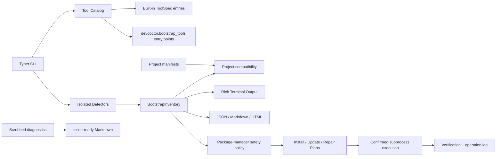

<p align="center">
  
</p>

<p align="center">
  <a href="https://github.com/AxiomNode-lab/DevDoctor/actions/workflows/ci.yml"></a>
  <a href="https://github.com/AxiomNode-lab/DevDoctor/actions/workflows/code-quality.yml"></a>
  
  
  <a href="LICENSE"></a>
</p>

<h1 align="center">DevDoctor</h1>

<p align="center">
  <strong>Diagnose broken Linux developer workstations before changing them.</strong><br>
  <sub>An open-source project by <a href="https://axiomnode.tech/">AxiomNode</a>, a student-led technology lab.</sub>
</p>

DevDoctor inspects the Linux workstation you already have, finds missing or broken developer tooling, explains package-manager and PATH conflicts, compares project requirements with the tools actually installed, and builds distro-aware repair or install plans that are previewed before execution.

It does not replace your package manager or environment manager. The goal is specific: identify what is wrong, show the local evidence, and produce the safest supported next step.

Scans are read-only. Project manifests are parsed without executing project hooks or scripts. Mutating commands require an explicit apply path and confirmation. When ownership or host policy is ambiguous, DevDoctor refuses instead of guessing.

## Demo

<p align="center">
  
</p>

The demo is generated from real command output. See [assets/screenshots](assets/screenshots/README.md) for regeneration notes.

## Example

```text
$ devdoctor check --profile devops --missing

DevDoctor  v1.2.0rc1          4 installed  7 missing  2 warnings  0 broken
Linux developer workstation bootstrap

Host
OS             Fedora Linux 42        Arch        x86_64
Shell          bash                   Desktop     GNOME
Session        wayland                Terminal    xterm-256color
Managers       dnf, flatpak, pip      PATH issues 1

Containers
! Docker       warning    29.0.0      /usr/bin/docker
  Repair: Docker daemon is not running
  Verify: docker info

DevOps
✗ kubectl                                     sudo dnf install kubernetes-client
✗ Helm                                        sudo dnf install helm
✗ Terraform                                   No supported local manager detected; see https://developer.hashicorp.com/terraform
```

Typical findings include Docker daemon failures, missing runtime dependencies, broken executable symlinks and launcher shebangs, duplicate PATH installations, conflicting package managers, missing Git identity, incomplete Android/Flutter tooling, Java without `JAVA_HOME`, Python without working pip, and user-space binaries that are not exported into PATH.

## Install

DevDoctor requires Python 3.11 or newer.

The product name is **DevDoctor**. The console command is **`devdoctor`**. The Python distribution prepared for publication is **`devdoctor-workstation`**.

> `devdoctor-cli` is not this project's distribution name. Do not use it to install or update this repository.

### Current repository build

Until the first `devdoctor-workstation` PyPI release is published and verified, install directly from this repository. The installer creates a user-owned virtual environment, links `~/.local/bin/devdoctor`, previews before acting, and never uses sudo:

```bash
curl -fsSL -o devdoctor-install.sh https://raw.githubusercontent.com/AxiomNode-lab/DevDoctor/main/scripts/install.sh
sh devdoctor-install.sh --source git
devdoctor --version
```

Or with pip alone:

```bash
python -m pip install "git+https://github.com/AxiomNode-lab/DevDoctor.git"
devdoctor --version
```

For development:

```bash
git clone https://github.com/AxiomNode-lab/DevDoctor.git
cd DevDoctor
python -m pip install -e ".[dev]"
```

A PyPI Trusted Publishing workflow is prepared for tagged releases. The README intentionally does not advertise `pip install devdoctor-workstation` until the public PyPI project has been created, published, and verified.

The Homebrew formula is also release-readiness work. Do not rely on a Homebrew install command until a tap exists and its clean installation CI passes.

## Quick start

```bash
devdoctor
devdoctor check --profile general
devdoctor check git docker node
devdoctor project .
devdoctor search docker
devdoctor repair docker
devdoctor diagnostics --stdout
devdoctor support --stdout
devdoctor manager-conflicts
devdoctor path-conflicts git python node
```

Preview installation work without changing the machine:

```bash
devdoctor install git docker --dry-run
devdoctor install --profile devops
```

Execute only after reviewing the plan:

```bash
devdoctor install --profile frontend --apply
```

## Project-aware preflight

A workstation can look healthy globally and still be wrong for the repository in front of you. `devdoctor project` reads supported declarative manifests and compares their requirements with the detected toolchain.

```text
$ devdoctor project .
DevDoctor project check: example-service
Sources: pyproject.toml, package.json
READY    python     found=3.13.7 required=>=3.12 source=pyproject.toml
MISMATCH node       found=20.19.0 required=>=22 source=package.json
MISSING  pnpm       found=not found required=9.15.0 source=package.json
```

The example shows output shape only. Project diagnosis supports selected evidence from `pyproject.toml`, `package.json`, `.tool-versions`, mise files, `Cargo.toml`, `go.mod`, `devbox.json`, language version files, Docker/Compose manifests, `Gemfile`, `composer.json`, and common Java build manifests.

It never evaluates project shell code or manifest-defined scripts. Symlinked supported manifests are not followed and each parsed file is bounded to 1 MB. Unsupported version expressions become `unknown` instead of being guessed.

For CI or onboarding:

```bash
devdoctor project . --json
```

During gradual adoption:

```bash
devdoctor project . --json --no-fail
```

See [Project-aware diagnostics](docs/PROJECT_DIAGNOSTICS.md) for the exact evidence and comparison contract.

### GitHub Action

The same check runs as a one-step action on any repository. It is read-only, prints the result to the job summary, and fails the job when a declared requirement is missing or mismatched (set `fail-on-mismatch: "false"` to only report):

```yaml
- uses: actions/checkout@v4
- uses: AxiomNode-lab/DevDoctor@main
  with:
    path: .            # directory with the project manifests (default: .)
    ref: main          # DevDoctor version to install: a tag or branch (default: main)
```

This repository runs it on itself in [`project-check.yml`](.github/workflows/project-check.yml).

## What changed since yesterday?

Every full scan (`devdoctor` with no selection) records a small snapshot in the user state directory. `devdoctor diff` rescans and reports what changed against it — tools that appeared or disappeared, health flips, version changes, PATH issue count — then makes the new scan the baseline:

```text
$ devdoctor diff
                       Changes since 2026-09-12T14:47:45+00:00
      Tool          Change        Before             After
  ✗   Node.js       disappeared   warning 20.20.2    —
  !   pip           health        ready              broken
  ↑   Git           version       2.43.0             2.45.0
  ✓   PATH issues   path          32                 2
```

`--json` for scripts, `--exit-code` to exit 1 when anything changed (like `git diff`), `--keep-baseline` to compare without recording, `--tools git,node` to rescan a subset and update only those entries.

## Better bug reports

`devdoctor support` converts the privacy-scrubbed diagnostic snapshot into Markdown that can be reviewed and pasted into a GitHub issue:

```bash
devdoctor support --stdout
devdoctor support --output devdoctor-support.md
```

The report intentionally omits hostname, username, raw PATH values, arbitrary environment values, shell history, and credentials. Session/shell values are normalized to small allowlists. Package and version names may still be sensitive, so review the report before publishing it.

The repository bug-report form asks for this report when available and requests `devdoctor project . --json --no-fail` for project-specific failures.

## Commands

| Command | Purpose |
| --- | --- |
| `devdoctor` | Full workstation inventory. |
| `devdoctor check [tools...]` | Inspect selected tools, a category, or a profile. |
| `devdoctor doctor [tools...]` | Run a focused workstation check. |
| `devdoctor project [PATH]` | Compare supported project requirements with the current workstation. |
| `devdoctor install [tools...]` | Preview or run distro-aware install plans. |
| `devdoctor repair [tools...]` | Show repair evidence and recommendations. |
| `devdoctor fix [tools...]` | Walk the Findings: preview each rollback-capable repair, `--apply` to run them one at a time with confirmation (alias of `repair-apply`). |
| `devdoctor repair-apply [tools...]` | Preview or apply rollback-capable repair actions. |
| `devdoctor repair-rollback TRANSACTION_ID` | Preview or apply a persisted rollback transaction. |
| `devdoctor verify [tools...]` | Exit non-zero when selected tools need attention. |
| `devdoctor diff` | Show what changed since the last full scan (appeared, disappeared, health, version, PATH issues). |
| `devdoctor search QUERY` | Search the local tool catalog. |
| `devdoctor manager-conflicts` | Report suspicious package-manager overlap. |
| `devdoctor path-conflicts [executables...]` | Report duplicate/version/ownership PATH conflicts. |
| `devdoctor diagnostics` | Export a privacy-scrubbed JSON support snapshot. |
| `devdoctor support` | Create a privacy-safe Markdown issue report. |
| `devdoctor completion SHELL` | Generate Bash, Zsh, or Fish completion text. |
| `devdoctor benchmark` | Measure a bounded local scan. |
| `devdoctor export json` | Export inventory JSON. |
| `devdoctor export markdown` | Export inventory Markdown. |
| `devdoctor update` | Preview package-manager update commands. |
| `devdoctor uninstall TOOL` | Remove only when installed ownership can be proven. |
| `devdoctor cache clean` | Preview supported package cache cleanup commands. |
| `devdoctor self-update` | Preview an update of the `devdoctor-workstation` distribution. |
| `devdoctor health` | Run the legacy health-style report and exporters. |

## Profiles

Profiles keep setup focused instead of installing every tool in a category.

```bash
devdoctor list profiles
devdoctor check --profile python
devdoctor install --profile cloud --dry-run
devdoctor verify --profile general
```

Built-in profiles include `general`, `frontend`, `backend`, `python`, `node`, `rust`, `go`, `java`, `flutter`, `android`, `data-science`, `ai`, `security`, `devops`, `cloud`, and `game`.

## Detection coverage

| Area | Examples |
| --- | --- |
| System | Distribution, architecture, desktop, session, shell, terminal, WSL, containers, virtualization, sudo availability, PATH issues. |
| Package managers | APT, DNF, rpm-ostree, Pacman, yay, paru, Zypper, XBPS, APK, Nix, Flatpak, Snap, Homebrew, Cargo, Go, pip, pipx, npm, pnpm, Yarn, Gem, Composer, Rustup, Flutter, mise, asdf. |
| Languages | Python, Node.js, Bun, Rust, Go, Java, .NET, PHP, Ruby. |
| Editors | Visual Studio Code, Vim, Neovim. |
| Containers and DevOps | Docker, Podman, Distrobox, kubectl, Helm, Terraform, Ansible. |
| Cloud CLIs | GitHub CLI, AWS CLI, Azure CLI, Google Cloud CLI. |
| Data and services | PostgreSQL client, MySQL client, SQLite, Redis CLI, systemd. |
| Security and debugging | OpenSSH, GnuPG, UFW, Nmap, GDB, strace, radare2. |
| Terminal and build tools | curl, wget, jq, ripgrep, fd, fzf, Starship, GCC, Clang, Make, CMake, Ninja. |
| Mobile, AI, and games | Android Debug Bridge, Flutter, Ollama, CUDA compiler, Godot. |
| Project evidence | Python/Node/Rust/Go version declarations, mise/asdf-style files, Devbox, Docker/Compose, Ruby/PHP/Java project manifests. |

For each tool DevDoctor can record installed state, executable path, parsed version, package ownership where the host can prove it, inferred installation method, configuration locations, dependency state, health, repair recommendations, and an install plan when a safe mapping exists.

Detection support is not the same as mutation support. See [distribution support evidence](docs/SUPPORTED_DISTROS.md) for the distinction between fixtures, clean-wheel checks, container integration, and real-workstation evidence.

## Fedora Atomic and Bazzite

Image-based Fedora derivatives need different rules from mutable Fedora. DevDoctor records an Atomic-host classification once in the inventory context from release evidence such as Bazzite identity, known Atomic variants, image identity, or OSTree version data.

The planner suppresses DNF host mutation on confirmed Fedora Atomic/Bazzite systems even when a `dnf` executable is present. Merely having an `rpm-ostree` executable on an otherwise mutable Fedora workstation is not sufficient to classify the host as Atomic.

Where mappings exist, the planner prefers appropriate user-space/package-scoped tooling first and uses rpm-ostree layering only as a host fallback. Synthetic Atomic/Bazzite container tests validate policy only. They are not presented as real workstation or hardware compatibility testing.

## Repair and rollback

Ordinary `repair` is advisory. `repair-apply` only exposes repair actions that include an executable command and a known rollback command. It previews by default and requires `--apply` before execution.

Applied actions are recorded in a transaction journal. `repair-rollback` requires the transaction ID, validates persisted rollback commands against a bounded allowlist, previews them, and requires a separate apply decision.

## PATH and package ownership

The PATH analyzer reports empty entries, duplicates, missing directories, non-searchable directories, common user binary directories that are not exported, and shadowed executables.

`path-conflicts` adds bounded version and package-ownership probes for duplicate executable names. `uninstall` uses a stricter rule: it refuses removal unless the executable owner can be matched to the catalog package. On Atomic systems, RPM ownership by itself is not considered proof that a package was rpm-ostree layered.

## Diagnostics and privacy

```bash
devdoctor diagnostics --stdout | python -m json.tool
devdoctor diagnostics --output devdoctor-diagnostics.json
devdoctor support --stdout
```

The support snapshot intentionally omits hostname, username, raw PATH values, arbitrary environment values, and secret/token values. Session type and shell name are normalized instead of copying arbitrary environment strings. Review diagnostic files before sharing them because package and version names can still reveal local environment details.

## Export formats

```bash
devdoctor --json > inventory.json
devdoctor --json-file inventory.json
devdoctor --markdown-file inventory.md
devdoctor --html-file inventory.html
devdoctor export json --output inventory.json
devdoctor export markdown --output inventory.md
```

JSON is the machine-readable inventory format. Markdown is useful for issues, handoffs, and onboarding notes. HTML is a standalone local report.

## Safety model

- Scans, search, diagnostics, support-report generation, conflict analysis, project diagnosis, and ordinary repair inspection are read-only.
- Project diagnosis does not execute hooks, package scripts, shell fragments, or version-manager activation commands.
- Symlinked supported project manifests are not followed and parsed manifests are size-bounded.
- DevDoctor does not use `shell=True` for its planned command execution path.
- Install, update, uninstall, cache cleanup, self-update, repair application, and rollback are preview-first.
- `--apply` is required for supported mutation paths.
- Confirmation remains enabled unless the user explicitly passes `--yes`.
- Confirmed Fedora Atomic/Bazzite host planning does not fall back to DNF mutation.
- Atomic planning prefers mapped user-space/package-scoped managers before rpm-ostree layering.
- Ambiguous package ownership causes uninstall to refuse rather than select a package manager by guesswork.
- Executed operations are recorded as structured JSON Lines in the user state directory.
- Verification commands run after successful operations when the plan provides one.
- Diagnostics are designed not to export secrets, credentials, shell history, hostname, username, or raw environment values.

## Architecture



The bootstrap model is centered on `ToolSpec`, `ToolDetection`, `InstallPlan`, `BootstrapProfile`, and `BootstrapInventory`. Host policy (Atomic/Bazzite classification, the user-space-first ordering, the Nix fallback) lives in `devdoctor.host_policy` and is applied by `install_plan_for_spec` itself, so importing the planner directly gives the same answers as the `devdoctor` command. `atomic_planning`, `fallback_planning`, and `hardening.apply_runtime_hardening` remain as thin compatibility shims; the privacy scrubber and release-safety wrappers are still applied at the entry point.

## Plugin catalog

Third-party packages can add bootstrap tools through the `devdoctor.bootstrap_tools` entry-point group.

```toml
[project.entry-points."devdoctor.bootstrap_tools"]
mytools = "my_package.devdoctor:get_tools"
```

Plugin detectors should be fast, local, non-destructive, and safe to run without root privileges. [`examples/plugin`](examples/plugin/README.md) is a complete installable example (`pip install -e examples/plugin`, then `devdoctor search lazygit`).

## Release verification

The `v1.2.0rc1` release pipeline is designed to build the Python distributions once, validate the clean wheel, generate `SHA256SUMS` and an SPDX 2.3 SBOM, create provenance/SBOM attestations, and then reuse those tested artifacts for GitHub Release and optional PyPI Trusted Publishing.

Expected release payload:

```text
devdoctor_workstation-1.2.0rc1-py3-none-any.whl
devdoctor_workstation-1.2.0rc1.tar.gz
devdoctor-install.sh
devdoctor.spdx.json
SHA256SUMS
```

PyPI publication remains disabled until the external Trusted Publisher for `devdoctor-workstation` and the protected `pypi` environment are configured. See [release distribution readiness](docs/RELEASE_DISTRIBUTION.md) and [v1.2.0rc1 release notes](docs/RELEASE_NOTES_v1.2.0rc1.md).

## Development

```bash
python -m pip install -e ".[dev]"
ruff format --check .
ruff check .
pytest
python -m devdoctor --quiet
python -m devdoctor --json | python -m json.tool
```

When changing package mappings, package identity, manifest parsing, or safety policy, add deterministic positive and negative tests. When changing CLI output, verify terminal output and machine-readable JSON.

## Roadmap

In order: publish to PyPI and cut a real release; `devdoctor diff` (what changed since the last scan); a guided, preview-first `devdoctor fix`; a stable JSON schema; recommended versions from project manifests; real Atomic/Bazzite host evidence; WSL/container-aware planning; shell-profile-aware PATH repair; version-manager awareness (nvm/pyenv/mise); localized output. Details and rationale in [ROADMAP.md](ROADMAP.md).

## FAQ

**Does DevDoctor install packages by default?**  
No. Inventory and planning are read-only. A supported mutation requires an explicit apply path.

**Does `devdoctor project` replace mise, Devbox, Nix, containers, or another environment manager?**  
No. Those tools can remain the project's source of truth. DevDoctor only diagnoses whether the current workstation matches the declarative requirements it can safely understand.

**Why not show one workstation score?**  
A workstation is only ready relative to the project in front of it. DevDoctor reports concrete installed, missing, warning, broken, and project-mismatch states instead of hiding them behind one score.

**Can I use it in CI or onboarding scripts?**  
Yes. `devdoctor verify --profile general --quiet` checks a profile; `devdoctor project . --json` checks supported repository requirements; `devdoctor --json` gives structured inventory data.

**Does it support non-Linux systems?**  
No. DevDoctor is intentionally Linux-first.

## Documentation

- [CLI reference](docs/CLI_REFERENCE.md)
- [Project-aware diagnostics](docs/PROJECT_DIAGNOSTICS.md)
- [Usage](docs/USAGE.md)
- [Checks and catalog reference](docs/CHECKS.md)
- [Distribution support evidence](docs/SUPPORTED_DISTROS.md)
- [Release distribution readiness](docs/RELEASE_DISTRIBUTION.md)
- [v1.2.0rc1 release notes](docs/RELEASE_NOTES_v1.2.0rc1.md)
- [Examples](examples/README.md)
- [Accessibility](docs/ACCESSIBILITY.md)
- [Brand system](docs/BRAND.md)
- [Release process](docs/RELEASE.md)
- [Release readiness](RELEASE_READINESS.md)
- [Roadmap](ROADMAP.md)
- [Migration guide](MIGRATION_GUIDE.md)
- [Security policy](SECURITY.md)
- [Support](SUPPORT.md)

## Contributing

Contributions are welcome when they keep DevDoctor local-first, Linux-focused, testable, and honest about unavailable evidence. Start with [CONTRIBUTING.md](CONTRIBUTING.md), run the validation commands, and include fixtures for package-manager or project-manifest changes.

## Credits

DevDoctor is built and maintained by [AxiomNode](https://axiomnode.tech/) (GitHub: [AxiomNode-lab](https://github.com/AxiomNode-lab)), a student-led technology lab building open-source software and practical tools. Contact: info@axiomnode.tech.

It uses [Typer](https://typer.tiangolo.com/), [Rich](https://rich.readthedocs.io/), [psutil](https://psutil.readthedocs.io/), and [platformdirs](https://platformdirs.readthedocs.io/).

## License

Copyright (c) 2026 AxiomNode and DevDoctor contributors. DevDoctor is released under the MIT License. See [LICENSE](LICENSE).

The DevDoctor name and the logo assets in `assets/brand/` identify the AxiomNode project; see [docs/BRAND.md](docs/BRAND.md) before reusing them for a fork or derived product.
